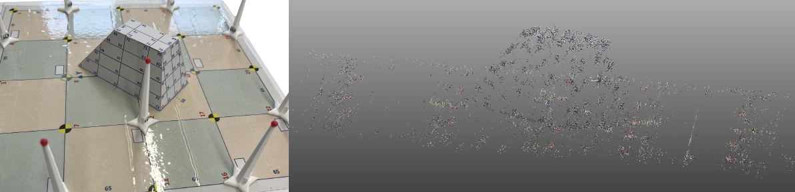
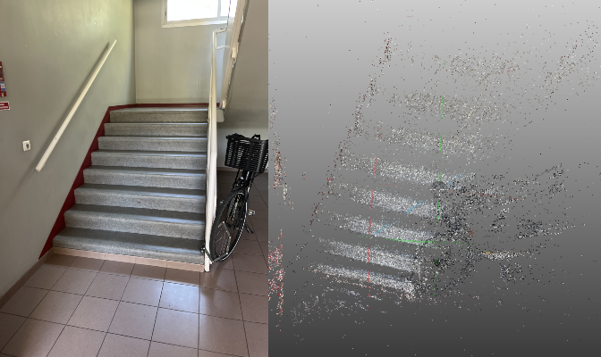
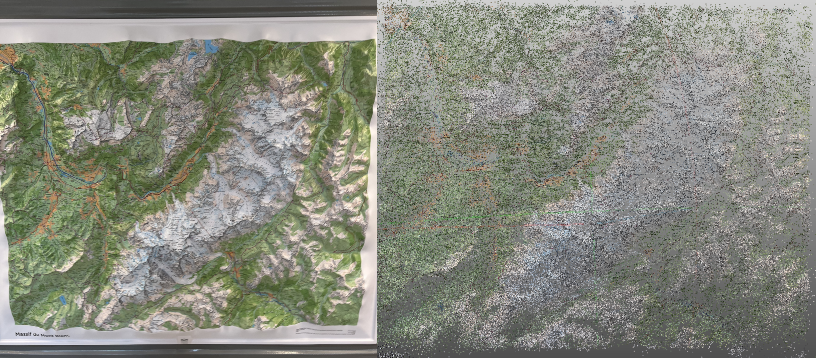
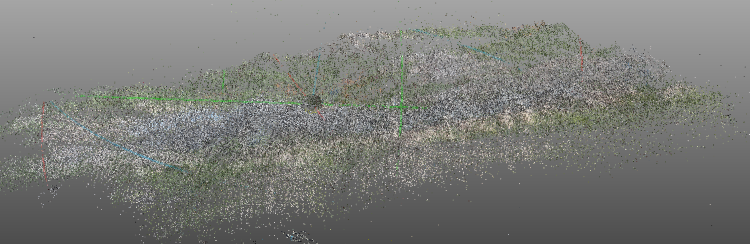
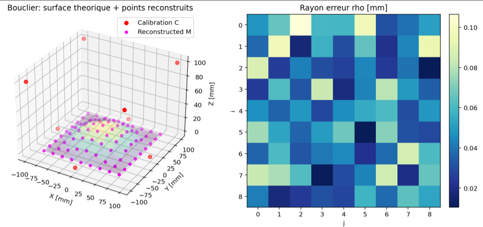
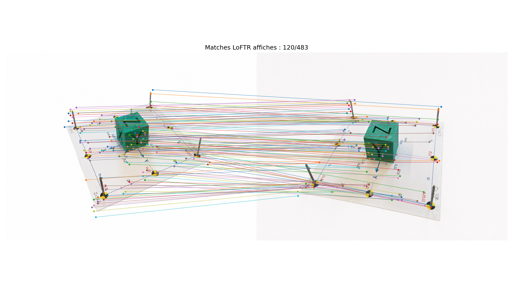
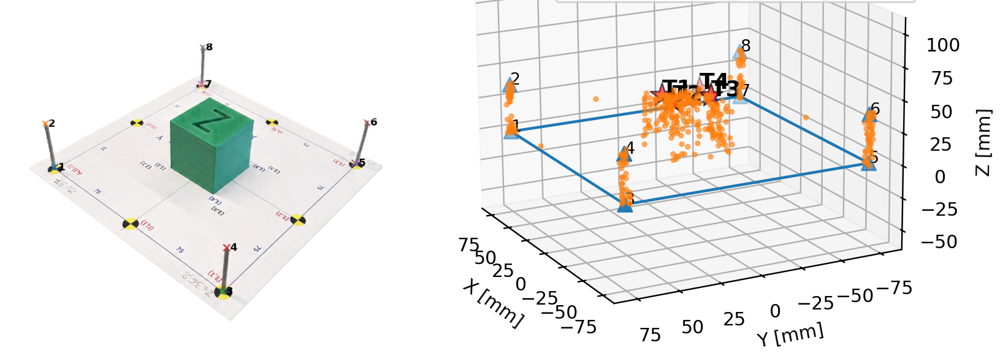
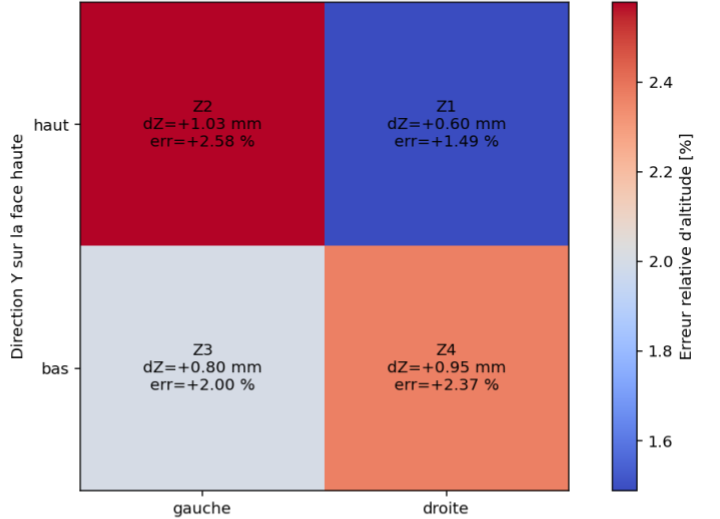

# 3D Reconstruction from Images — Photogrammetry

This project implements a Python pipeline for reconstructing 3D point clouds from multiple images using photogrammetry.

The project is mainly focused on **relative orientation**, where the camera poses are estimated from correspondences between images, without using a known 3D reference frame. A second part based on **absolute orientation** is also included to validate and apply the geometric reconstruction pipeline using known calibration points.

---

## 1. Relative Orientation

Relative orientation aims to reconstruct a 3D scene from several images by estimating the relative positions and orientations of the cameras.

Unlike absolute orientation, the 3D reference frame of the object is not known in advance. The reconstruction is obtained only from correspondences between images.

The pipeline follows these steps:

* Detect and match feature points between images
* Remove inconsistent matches using RANSAC
* Estimate the fundamental matrix
* Compute the essential matrix using camera intrinsics
* Recover the relative camera poses
* Triangulate 3D points
* Export and visualize the reconstructed point cloud

In this part, feature matching was mainly done with **SIFT**. SIFT detects local keypoints in an image and describes them using local gradient information, usually summarized as orientation histograms around each point. This makes it useful for matching textured regions across different views.

---

## Geometric Principle

For two images, a 3D point is projected into two corresponding image points. In homogeneous coordinates, these image points are written as:

$$\mathbf{x}_1 = (u_1, v_1, 1)^T, \qquad \mathbf{x}_2 = (u_2, v_2, 1)^T.$$

The two corresponding points must satisfy the epipolar constraint:

$$\mathbf{x}_2^T \mathbf{F}\mathbf{x}_1 = 0.$$

Here, $\mathbf{F}$ is the fundamental matrix. It describes the projective geometric relation between two camera views.

In practice, some feature matches are wrong. RANSAC is used to robustly estimate $\mathbf{F}$ while rejecting outliers. It repeatedly samples small sets of matches, estimates a candidate fundamental matrix, and keeps the model that explains the largest number of consistent correspondences.

For a candidate fundamental matrix $\mathbf{F}$, the number of inliers can be written as:

$$N_{inliers}(\mathbf{F}) = \sum_{i=1}^{M} I[d(\mathbf{x}*{2,i}, \mathbf{F}\mathbf{x}*{1,i}) < \tau].$$

where:

* $M$ is the number of tentative matches;
* $d$ is the epipolar error;
* $\tau$ is the inlier threshold;
* $I[\cdot]$ is the indicator function.

RANSAC keeps the matrix $\mathbf{F}$ with the largest number of inliers. The other matches are rejected as outliers.

For each RANSAC candidate, the fundamental matrix can be estimated from point correspondences by writing the epipolar constraints as a linear system:

$$\mathbf{A}\mathbf{f} = 0.$$

The vector $\mathbf{f}$ contains the coefficients of $\mathbf{F}$. This homogeneous least-squares problem is typically solved using **Singular Value Decomposition (SVD)** by selecting the singular vector associated with the smallest singular value, then reshaping it into the matrix $\mathbf{F}$.

Once the fundamental matrix is estimated, the essential matrix is computed using the intrinsic calibration matrix $\mathbf{K}$:

$$\mathbf{E} = \mathbf{K}^T \mathbf{F}\mathbf{K}.$$

The relative rotation and translation between the two cameras are then recovered from $\mathbf{E}$. Finally, the 3D points are reconstructed by triangulation.

---

## Relative Orientation Results

The relative-orientation pipeline was tested on several real scenes.

| Scene           | Images | Reconstructed cameras | 3D points |
| --------------- | -----: | --------------------: | --------: |
| Pyramid         |     23 |                 23/23 |    19,388 |
| Stairs          |     39 |                 39/39 |   106,634 |
| Topographic map |     32 |                 32/32 |   391,093 |

The pyramid reconstruction was evaluated after scale alignment. The average relative error was about **2.47%**, corresponding to an average absolute error of about **1.5 mm**.

---

## Example Reconstructions

### Pyramid

  

### Stairs & Bike

  

### Topographic map of Mont Blanc — top view

  

### Topographic map of Mont Blanc — side view

  

---

## 2. Absolute Orientation

Absolute orientation was used to reconstruct objects in a known metric frame.

In this setup, several 3D calibration points are known in advance. Their corresponding 2D positions are manually selected in each image. From these 2D/3D correspondences, the camera projection matrices are estimated, then matched image points are triangulated to obtain their 3D coordinates.

This makes absolute orientation useful not only for 3D reconstruction, but also for obtaining approximate measurements of objects placed in a known reference frame. In this project, the calibration points were selected manually, but this step could later be automated using a detection algorithm for reference markers or object keypoints.

The camera projection model is:

$$\mathbf{x} \sim \mathbf{P}\mathbf{X}.$$

where:

* $\mathbf{X}$ is a 3D point in homogeneous coordinates;
* $\mathbf{x}$ is its 2D image projection;
* $\mathbf{P}$ is the camera projection matrix.

The projection matrix $\mathbf{P}$ is estimated using DLT from known 3D calibration points and their corresponding 2D image positions.

---

## Validation on Theoretical Data

Before using automatic feature matching methods such as SIFT or LoFTR, the geometric pipeline was first validated on theoretical data.

The goal was to check that the core photogrammetry algorithm works correctly when the correspondences are known. This validation includes:

* projection of known 3D points into the images;
* DLT calibration of the camera projection matrices;
* extraction of camera parameters;
* triangulation of the reconstructed 3D points;
* comparison with the theoretical object.

The reconstructed shield was compared with the theoretical surface, and the reconstruction error was very low: the average error was about **47.7 µm**, with a maximum error of about **106.5 µm**.

This confirms that the projection, calibration and triangulation pipeline is functional. In later experiments, the main difficulty therefore comes mostly from the quality of image matching, not from the geometric model itself.

  

---

## Absolute Orientation with LoFTR

After validating the base geometric algorithm, **LoFTR** was added to automatically match points between real images.

SIFT was first tested, but it did not provide sufficiently stable correspondences for the absolute-orientation setup, especially on low-texture areas and repeated patterns. LoFTR gave more reliable matches by using a neural-network-based approach. Instead of relying only on local keypoints and gradient descriptors, LoFTR uses convolutional features and transformer-based attention to match image regions with more global context.

The absolute-orientation pipeline with LoFTR follows these steps:

* manually select the calibration points in each image;
* estimate the camera projection matrices from the calibration points;
* use LoFTR to find corresponding points between images;
* triangulate the matched points into 3D;
* remove incoherent reconstructed points using geometric filtering;
* visualize the final 3D point cloud.

Since LoFTR is not perfectly accurate, some reconstructed points can still be incoherent. A filtering step is therefore needed to remove points that are too far from the expected object region or inconsistent with the reconstructed scene.

For better results, the image acquisition should be done with several views, ideally around **10 to 15 pictures**, while slowly rotating around the object. This increases overlap between views and improves the stability of the reconstruction.

### LoFTR matching

  

### Cube reconstruction

  

---

## Absolute Orientation Error

To evaluate the cube reconstruction, four control points were selected on the letter **Z** located on the top face of the cube. The cube has an edge length of **40 mm**.

These points were reconstructed in 3D, and their altitude was compared with the theoretical altitude of the top face.

The vertical error is:

$$e_z = z_{\mathrm{rec}} - z_{\mathrm{true}}.$$

where:

* $z_{\mathrm{rec}}$ is the reconstructed altitude;
* $z_{\mathrm{true}}$ is the theoretical altitude.

The maximum altitude error obtained was about **1.03 mm**, which shows that the reconstructed height is close to the real one.

  

---

## Technologies

Python, OpenCV, NumPy, SciPy, Matplotlib, SIFT, RANSAC, LoFTR, CloudCompare

---

## Code

For the relative-orientation reconstruction, the folder `images_multivues` must be placed in the same directory as the script `reconstruction_incrementale.py`.

relative_orientation/
├── reconstruction_incrementale.py
└── images_multivues/

---

## Notes

This repository is intended as a project presentation rather than a fully packaged software library.

---

## Project Context

Academic project at IMT Atlantique on 3D reconstruction by photogrammetry.
